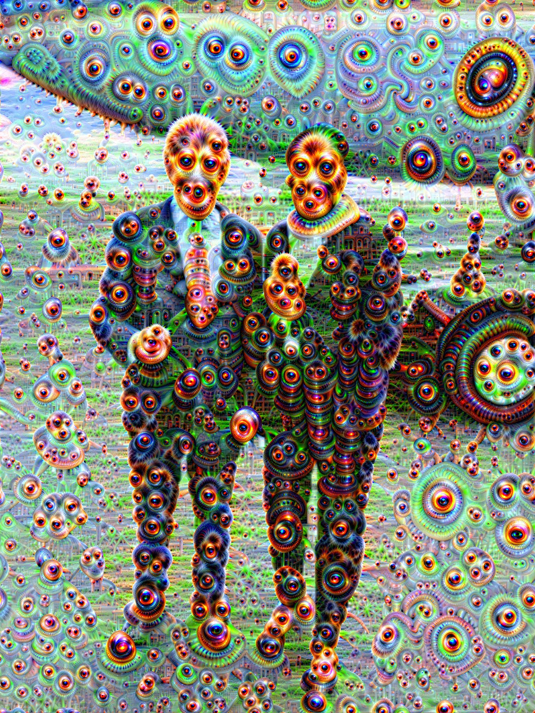

# DeepDream-MLX

Native, hardware-accelerated DeepDream for Apple Silicon.
We ripped out the slow parts and baked the compute graph directly into the GPU.

**Status:** Fast. 
**Vibe:** 2015 Aesthetics // 2025 Hardware.

## Quick Start

```bash
# Needs typical scientific stack + mlx
pip install mlx numpy pillow scipy

# Dream
python dream.py --input love.jpg --model vgg16
```

## The Models

We support the heavy hitters. Weights are converted and ready.

*   **VGG16:** The Painter. Rich textures, thick brushstrokes.
*   **GoogLeNet (InceptionV1):** The Hallucination. Eyes, animals, geometry.
*   **VGG19:** The Stylist. Complex, layered patterns.
*   **ResNet50:** The Modernist. Sharp, deep structures.

## Weight Conversion

We didn't just wrap existing libs. We wrote custom exporters (`export_*.py`) to rip weights from standard PyTorch/Torchvision archives and serialize them into optimized MLX `.npz` arrays. 

This unlocks the classic Caffe-era architectures for the Apple Unified Memory architecture. No bloat, just tensors.

## Examples

### 1. VGG16: The Deep Texture
*Targeting `relu4_2` for rich, painterly artifacts.*

```bash
python dream.py --input love.jpg \
    --model vgg16 \
    --steps 24 \
    --lr 0.07 \
    --pyramid_size 4 \
    --pyramid_ratio 1.8 \
    --jitter 36 \
    --smoothing_coefficient 0.19 \
    --layers relu4_2
```


### 2. GoogLeNet: The Multi-Scale Trip
*Hitting `inception3a`, `4e`, and `5b` simultaneously.*

```bash
python dream.py --input love.jpg \
    --model googlenet \
    --steps 22 \
    --lr 0.061 \
    --pyramid_size 4 \
    --pyramid_ratio 1.8 \
    --jitter 26 \
    --smoothing_coefficient 0.08 \
    --layers inception3a inception4e inception5b
```


### 3. VGG19: The Quick Study
*A shallower, aggressive run on `relu5_2`.*

```bash
python dream.py --input love.jpg \
    --model vgg19 \
    --steps 14 \
    --lr 0.045 \
    --pyramid_size 2 \
    --pyramid_ratio 1.5 \
    --jitter 27 \
    --smoothing_coefficient 0.41 \
    --layers relu5_2
```


## File Structure

*   `dream.py`: The engine. Compiled graph execution.
*   `mlx_*.py`: Model definitions ported to native MLX.
*   `*.npz`: The weights (ported by us).
*   `export_*.py`: The bridge scripts that brought these models here.

---
*NickMystic*
