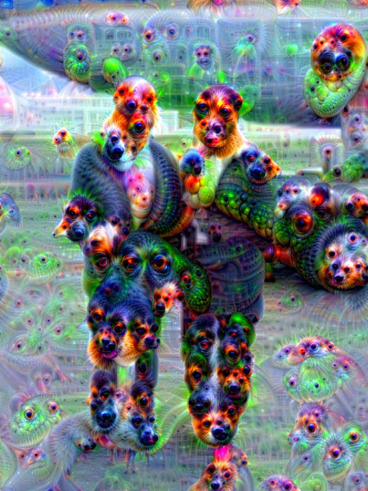
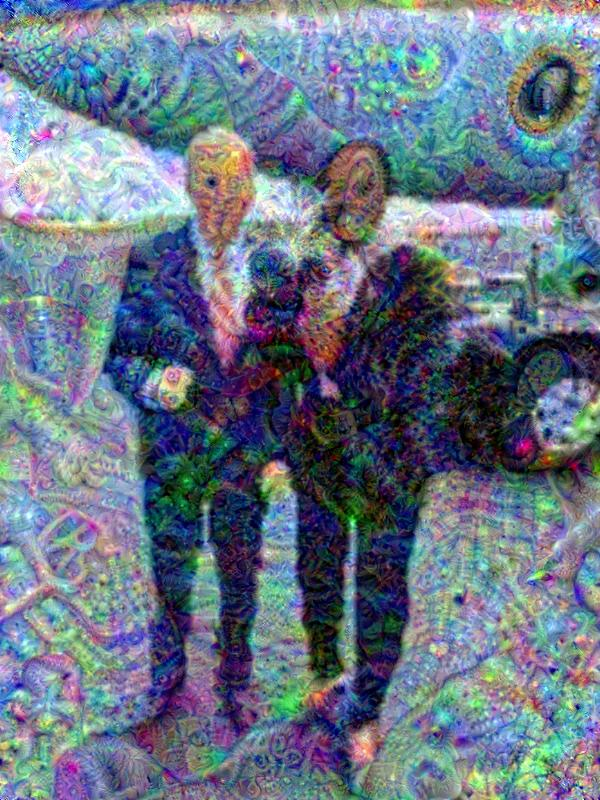

# DeepDream with MLX

A fast and efficient implementation of DeepDream using Apple's MLX framework. This implementation leverages MLX's graph compilation and native operations to deliver high-performance image generation on Apple Silicon.

## Features

*   **Optimized for Apple Silicon:** Uses MLX for GPU-accelerated tensor operations.
*   **Fast Execution:** significantly faster than standard PyTorch/TensorFlow implementations on Mac.
*   **Multiple Models:** Supports VGG16 (default), VGG19, GoogLeNet, and ResNet50.
*   **High-Res Dreaming:** Efficiently handles high-resolution images with tile-based processing (implicit in conv ops) and multi-scale pyramids.

## Installation

1.  **Clone the repository:**
    ```bash
    git clone https://github.com/mystic/deepdream-mlx-models.git
    cd deepdream-mlx-models
    ```

2.  **Install dependencies:**
    ```bash
    pip install -r requirements.txt
    ```
    *Make sure you have `mlx` installed. If not, `pip install mlx`.*

## Usage

The main script is `dream.py`.

### Basic Usage

Generate a DeepDream image using the default VGG16 model:

```bash
python dream.py --input love.jpg
```

This will save the output as `love_dream_[time]...jpg`.

### Advanced Usage

Customize the dream parameters:

```bash
python dream.py --input love.jpg \
    --output dreamy_love.jpg \
    --model googlenet \
    --img_width 800 \
    --layers inception4c \
    --steps 20 \
    --pyramid_size 6 \
    --jitter 32
```

### Arguments

*   `--input`: Path to the input image (required).
*   `--output`: Path to save the output image (optional, auto-generated if omitted).
*   `--model`: Model architecture to use: `vgg16` (default), `vgg19`, `googlenet`, `resnet50`.
*   `--img_width`: Resize input image to this width (maintains aspect ratio). Default: uses original size.
*   `--layers`: Specific layers to maximize activations for.
*   `--steps`: Number of gradient ascent steps per pyramid scale (default: 10).
*   `--lr`: Learning rate (step size) (default: 0.09).
*   `--pyramid_size`: Number of scales in the image pyramid (default: 4).
*   `--pyramid_ratio`: Scale factor between pyramid levels (default: 1.8).
*   `--jitter`: Amount of random image shift (jitter) to apply (default: 32).

## Examples

### 1. VGG16 "Artistic" Style
*Using the default VGG16 model, known for its rich, painterly textures.*

```bash
python dream.py --input love.jpg --model vgg16 --img_width 600 --output assets/example_vgg16.jpg
```



### 2. GoogLeNet "Classic" Style
*Using GoogLeNet (InceptionV1), the classic DeepDream model known for eyes and animals.*

```bash
python dream.py --input love.jpg --model googlenet --img_width 600 --output assets/example_googlenet.jpg
```



## Acknowledgments

*   Original DeepDream implementation by Google.
*   Apple MLX team for the framework.
*   This implementation includes optimized Gaussian smoothing and compiled update steps for maximum performance.
