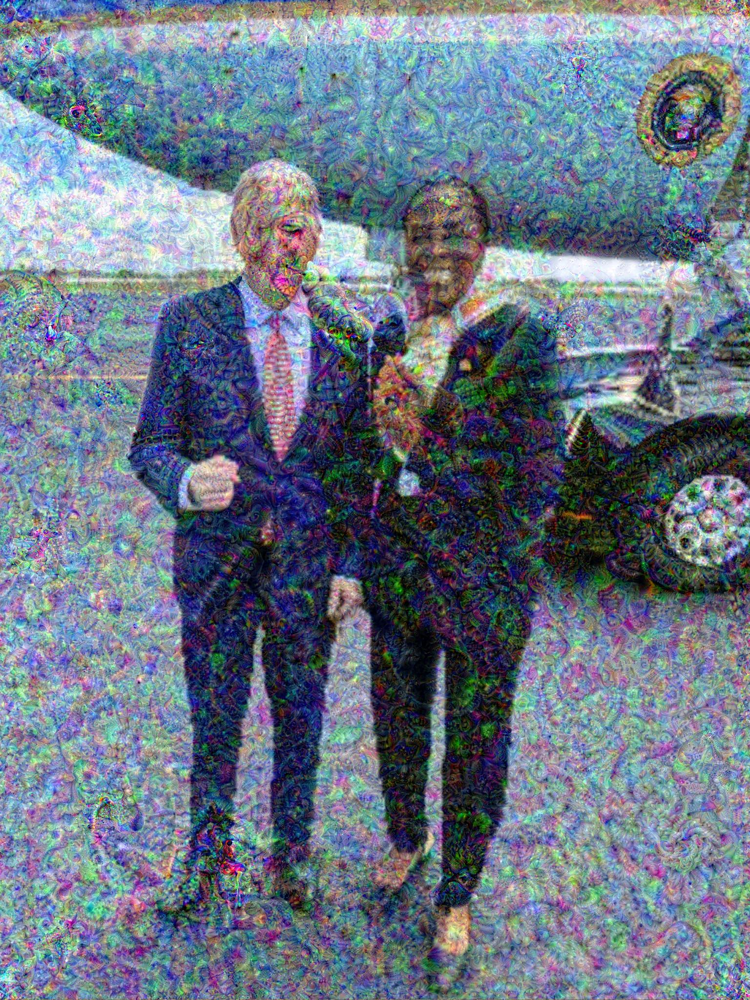
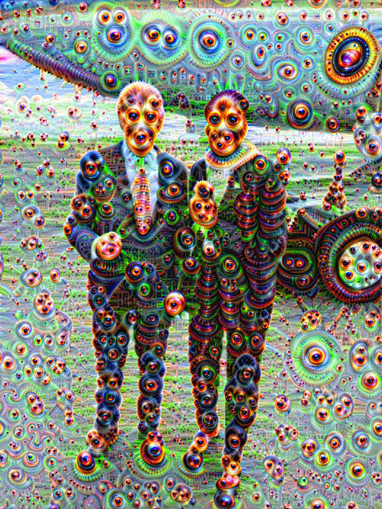
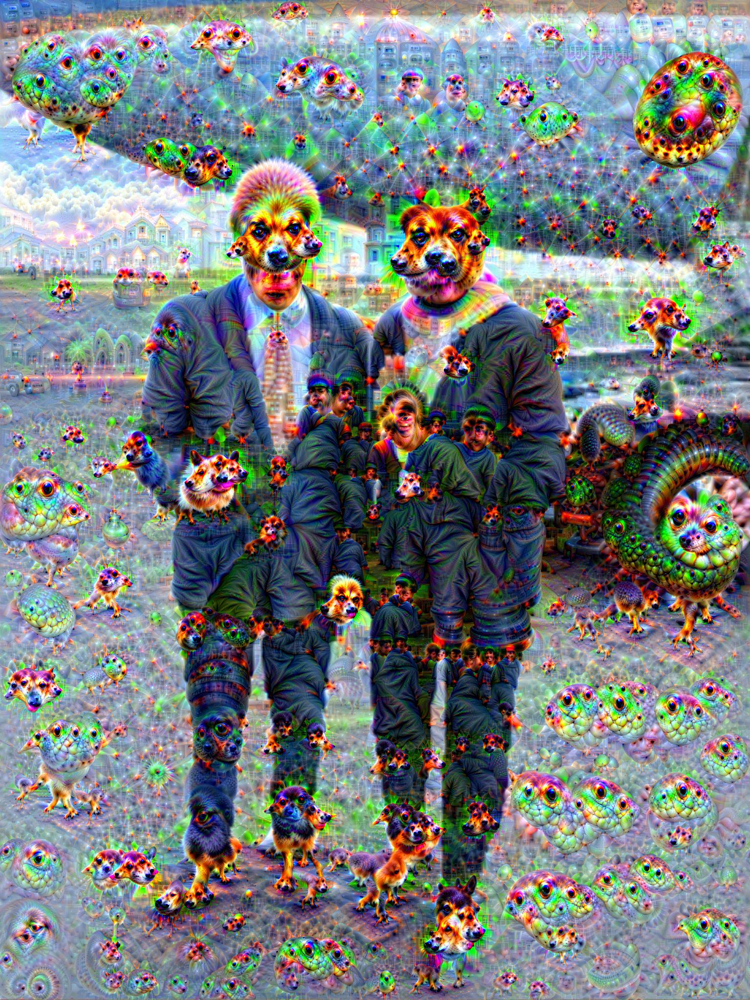
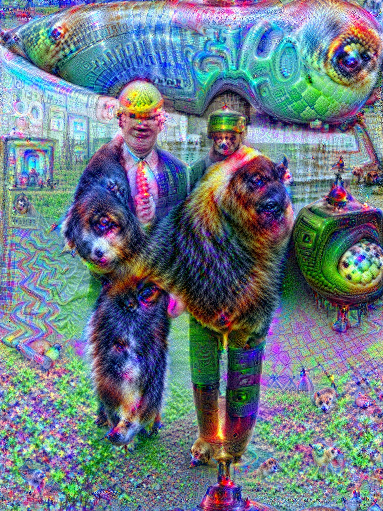

--- 
license: mit
tags:
- mlx
- computer-vision
- art
- generative
pipeline_tag: image-to-image
---

# DeepDream-MLX

Native, hardware-accelerated DeepDream for Apple Silicon.
We ripped out the slow parts and baked the compute graph directly into the GPU.

**Status:** Fast. 
**Vibe:** 2015 Aesthetics // 2025 Hardware.


## The Lineage

VGG and GoogLeNet are cousins, evolving from AlexNet (2012) but taking different paths: one went **Deep**, the other went **Wide**.

```text
THE CONVOLUTIONAL ANCESTRY
==========================

┏━ LeNet-5 (1998) ━━━┓  <-- The Grandfather (Yann LeCun)
┃          ┃          ┃
┃          ▼          ┃
┣━ AlexNet (2012) ━━━┫  <-- The Big Bang. The first GPU craze.
┃          ┃          ┃
┃          ┣━━━━━━━━━━━━━━━━━━━━━━━━━━━━━━━━━━━━━━━━━━━━━━━━━━━━━┳━┓
┃          ┃                                                     ┃ ┃
┃  ┏━━━━━━━┻━━━━━━━┓                              ┏━━━━━━━━━━━━━━━┻━━━━━━━┓
┃  ┃ THE OXFORD BRANCH ┃                              ┃ THE GOOGLE BRANCH ┃
┃  ┃ (Philosophy: "Go Deeper") ┃                      ┃ (Philosophy: "Go Wider") ┃
┃  ┗━━━━━━━━━━━━━━━┛                              ┗━━━━━━━━━━━━━━━┛
┃          ┃                                                     ┃
┃          ┃                                                     ┃
┃  ┏━━━━━━━┻━━━━━━━┓                              ┏━━━━━━━━━━━━━━━┻━━━━━━━┓
┃  ┃ VGG (Visual Geometry Group) ┃                  ┃ Inception (GoogLeNet) ┃
┃  ┗━━━━━━━━━━━━━━━┛                              ┗━━━━━━━━━━━━━━━┛
┃          ┣━━━━━━━━━━━━━━━━━━━━━┳━┓                          ┃
┃          ┃                     ┃ ┃                          ┃
┃  ┏━━━━━━━┻━━━━━━━┓    ┏━━━━━━━┻━━━━━━━┓                      ┃
┃  ┃    VGG16    ┃    ┃    VGG19    ┃                      ┃
┃  ┗━━━━━━━━━━━━━━━┛    ┗━━━━━━━━━━━━━━━┛                      ┃
┃          ┃                     ┃                              ┃
┃          ┗━ vgg16_mlx.npz      ┗━ vgg19_mlx.npz               ┃
┃             (Our Port)            (Our Port)                 ┃
┃                                                              ┃
┃  ┏━━━━━━━━━━━━━━━━━━━━━━━━━━━━━━━━━━━━━━━━━━━━━━━━━━━━━━━┓
┃  ┃                                                       ┃
┃  ┗━ Inception V1 ━━━━━━━━━━━━━━━┳━━━━━━━━━━━━━━━━━━━━━━━┛
┃                                  ┃
┃                                  ┣━ bvlc_googlenet.caffemodel
┃                                  ┃  (Berkeley's Caffe Ref.)
┃                                  ┗━ googlenet_mlx.npz (Our Port)
┃
┗━━━━━━━━━━━━━━━━━━━━━━━━━━━━━━━━━━━━━━━━━━━━━━━━━━━━━━━━━━━━━━━━━━━━━━━━━━━┛
```
## Quick Start

```bash
# Needs typical scientific stack + mlx
pip install mlx numpy pillow scipy

# Dream with default VGG16
python dream.py --input love.jpg

# Dream with ALL models
python dream.py --input love.jpg --model all
```

## The Models

*   **VGG16:** The Painter. Rich textures, thick brushstrokes.
*   **GoogLeNet (InceptionV1):** The Hallucination. Eyes, animals, geometry.
*   **VGG19:** The Stylist. Complex, layered patterns.
*   **ResNet50:** The Modernist. Sharp, deep structures.

## Recipes

Here are some commands to generate awesome DeepDream outputs:

### 1. GoogLeNet (The Classic Trip)
*Multi-scale hallucination targeting `inception3a`, `4e`, and `5b`.*

```bash
python dream.py --input love.jpg \
    --model googlenet \
    --steps 22 \
    --lr 0.061 \
    --octaves 4 \
    --scale 1.8 \
    --jitter 26 \
    --smoothing 0.08 \
    --layers inception3a inception4e inception5b
```


### 2. VGG16 (The Deep Texture)
*Rich artistic textures targeting `relu4_2`.*

```bash
python dream.py --input love.jpg \
    --model vgg16 \
    --steps 24 \
    --lr 0.07 \
    --octaves 4 \
    --scale 1.8 \
    --jitter 36 \
    --smoothing 0.19 \
    --layers relu4_2
```


### 3. VGG19 (The Quick Study)
*Aggressive, shallow run on `relu5_2`.*

```bash
python dream.py --input love.jpg \
    --model vgg19 \
    --steps 14 \
    --lr 0.045 \
    --octaves 2 \
    --scale 1.5 \
    --jitter 27 \
    --smoothing 0.41 \
    --layers relu5_2
```


### 4. VGG16 (A Different Vision)
*Another take on VGG16, focusing on `relu5_1` for different patterns.*

```bash
python dream.py --input love.jpg \
    --model vgg16 \
    --steps 24 \
    --lr 0.069 \
    --octaves 4 \
    --scale 1.8 \
    --jitter 10 \
    --smoothing 0.41 \
    --layers relu5_1
```


### 5. ResNet50 (The Modernist Edge)
*Exploring deeper layers `layer3_2` and `layer3_5` for sharp, abstract forms.*

```bash
python dream.py --input love.jpg \
    --model resnet50 \
    --steps 22 \
    --lr 0.13 \
    --octaves 4 \
    --scale 2 \
    --jitter 83 \
    --smoothing 0.47 \
    --layers layer3_2 layer3_5
```


## Weight Conversion

We didn't just wrap existing libs. We wrote custom exporters (`export_*.py`) to rip weights from standard PyTorch/Torchvision archives and serialize them into optimized MLX `.npz` arrays. 

This unlocks the classic Caffe-era architectures for the Apple Unified Memory architecture. No bloat, just tensors.

---
*NickMystic*
